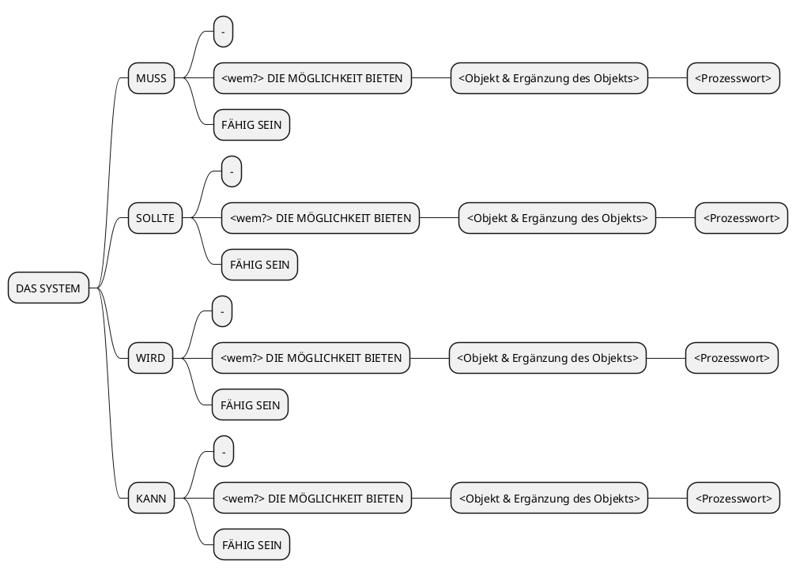

A User Story consists of th Who, What and the Why.

```plantuml
@startmindmap
+ DAS SYSTEM
++ MUSS
+++ -
+++ <wem?> DIE MÖGLICHKEIT BIETEN
++++ <Objekt & Ergänzung des Objekts>
+++++ <Prozesswort>
+++ FÄHIG SEIN
++ SOLLTE
+++ -
+++ <wem?> DIE MÖGLICHKEIT BIETEN
++++ <Objekt & Ergänzung des Objekts>
+++++ <Prozesswort>
+++ FÄHIG SEIN
++ WIRD
+++ -
+++ <wem?> DIE MÖGLICHKEIT BIETEN
++++ <Objekt & Ergänzung des Objekts>
+++++ <Prozesswort>
+++ FÄHIG SEIN
++ KANN
+++ -
+++ <wem?> DIE MÖGLICHKEIT BIETEN
++++ <Objekt & Ergänzung des Objekts>
+++++ <Prozesswort>
+++ FÄHIG SEIN
@endmindmap
```

```plantuml
@startuml
state DAS SYSTEM
state MUSS

@enduml
```